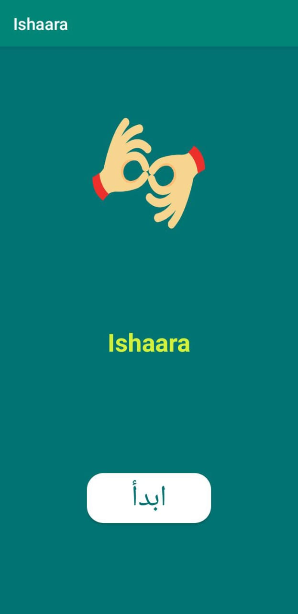
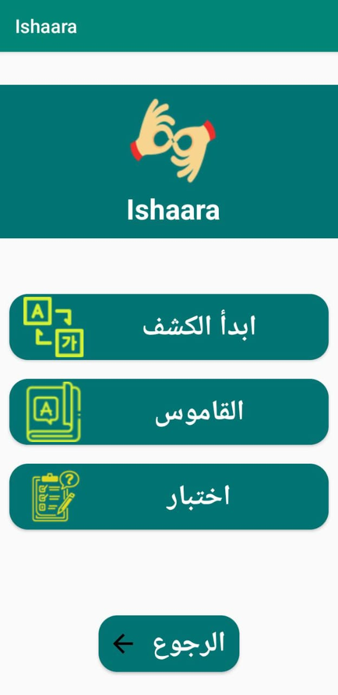
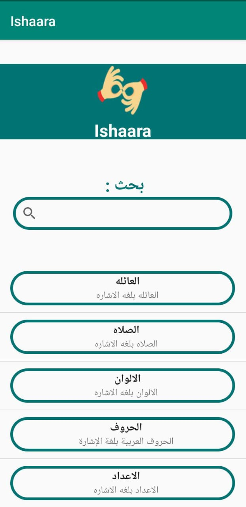
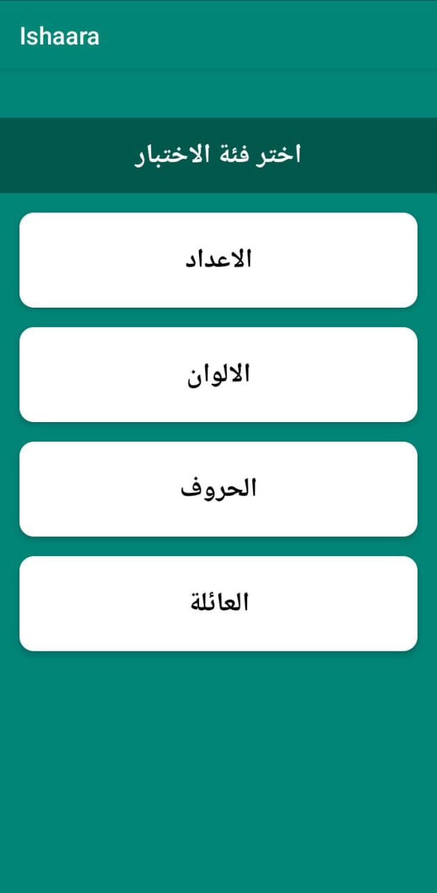
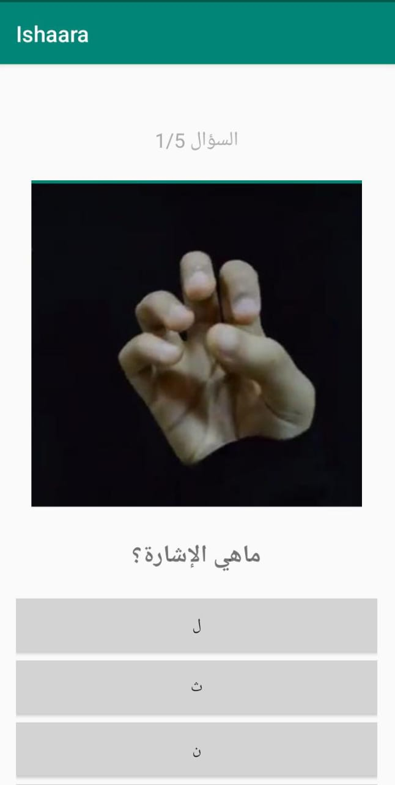

# 🤟 ISHAARA - Mobile Sign Language Learning App

## 📱 Project Description

**ISHAARA** is an innovative Android mobile application designed to facilitate learning Arabic sign language. Developed as part of the Engineering Cycle in Information Systems and Big Data, this application combines interactive pedagogical methods with artificial intelligence technologies to provide a complete and engaging learning experience.

### 👥 Development Team

- **Maria Elhoudaigui**
- **Ilham Bouatioui**

---

## 🎯 Problem Statement

Sign language learning faces several major challenges:

1. **Limited Access**: Learning resources are rare and difficult to access
2. **Lack of Interactivity**: Absence of immediate feedback when practicing gestures
3. **Social Inclusion Barriers**: Communication difficulty between deaf and hearing people

---

## 💡 Proposed Solution

ISHAARA offers a three-step approach for effective learning:

### 📚 Learn
A structured pedagogical video library to assimilate sign language basics

### 🎯 Practice
A real-time detection module via camera to actively exercise

### ✅ Validate
Interactive quizzes with instant correction to evaluate knowledge

---

## ✨ Main Features

### 🎥 Module 1: Video Dictionary

- Complete video library of signs classified by categories
- Clear and concise pedagogical videos
- Search function to quickly find a sign
- Intuitive interface with integrated video player
- Progress bar and playback controls


### 📝 Module 2: Interactive Quizzes

- Multiple choice questions (4 options per question)
- Various thematic categories
- Immediate correction with correct answer display
- Final score and performance feedback
- Illustrative images for each question

---

### 📷 Module 3: Camera Detection (AI)

**The heart of our innovation!**

- Real-time gesture recognition via camera
- Immediate feedback on sign accuracy
- TensorFlow Lite for image analysis
- AI model trained to recognize Arabic signs
---

## 🛠️ Technologies Used

* **Android Studio** (Integrated Development Environment)
* **Java** (Main Programming Language)
* **Firebase Firestore** (NoSQL Database)
* **GitHub** (Video and Image Hosting)
* **TensorFlow Lite** (Real-time Gesture Detection)
* **Gradle** (Dependency Management)
* **Camera2 API** (Camera Access)
* **RecyclerView** (List Display)
* **MediaPlayer/VideoView** (Video Playback)

---


## 🔥 Firebase Database Structure

### Collection "Videos" (Firestore)
Stores video metadata:
- `description`: Sign description
- `tag`: Sign category
- `url`: Link to video hosted on GitHub

### Collection "Quizzes" (Firestore)
Stores quiz questions:
- `question`: Question text
- `correctAnswer`: Correct answer
- `options`: List of 4 answer options
- `imageUrl`: Associated image URL (hosted on GitHub)
- `category`: Quiz category

---

## 🚀 Installation & Setup

### Prerequisites

* Android Studio (latest version recommended)
* JDK 8 or higher
* Android device or emulator (API 21+)
* Firebase account

---

### 1️⃣ Clone the Repository

---

### 2️⃣ Open Project in Android Studio

```bash
File > Open > Select project folder
```

---

### 3️⃣ Firebase Configuration

1. Create a Firebase project
2. Download `google-services.json` file
3. Place file in `app/` folder
4. Create "Videos" and "Quizzes" collections in Firestore

---

### 4️⃣ Sync Gradle

```bash
Tools > Gradle > Sync Project with Gradle Files
```

---

### 5️⃣ Build and Run

```bash
Run > Run 'app'
```

---

## 📖 User Guide

### 1️⃣ Home Screen
Launch the application and access the main menu

### 2️⃣ Main Menu
Choose from three main features:
* 📚 **Dictionary** - Learn signs
* 📝 **Quiz** - Test your knowledge
* 📷 **Detection** - Practice in real-time

### 3️⃣ Dictionary
Browse categories or use search to find a sign

### 4️⃣ Quiz
Select a category and test your knowledge with interactive questions

### 5️⃣ Detection
Activate camera and practice your signs with instant AI feedback

---


## 📄 License

This project was developed in an academic framework at the National School of Applied Sciences of Berrechid.

---

## 📧 Contact

For any questions or suggestions:

- **Maria Elhoudaigui** - [[email](maria.elhoudaigui@gmail.com/)/[linkedin](https://www.linkedin.com/in/maria-el-houdaigui/)]


## 📸 Screenshots







---

**Developed with ❤️ by Maria Elhoudaigui and Ilham Bouatioui**
